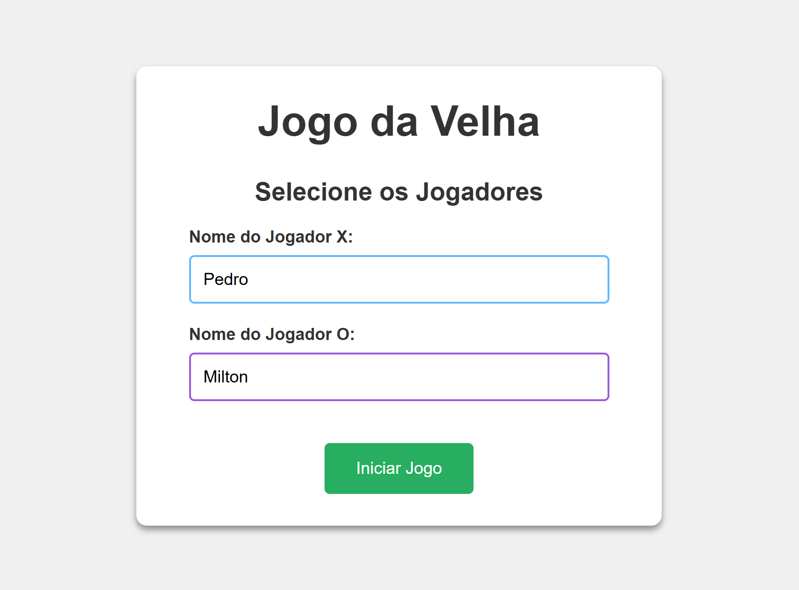
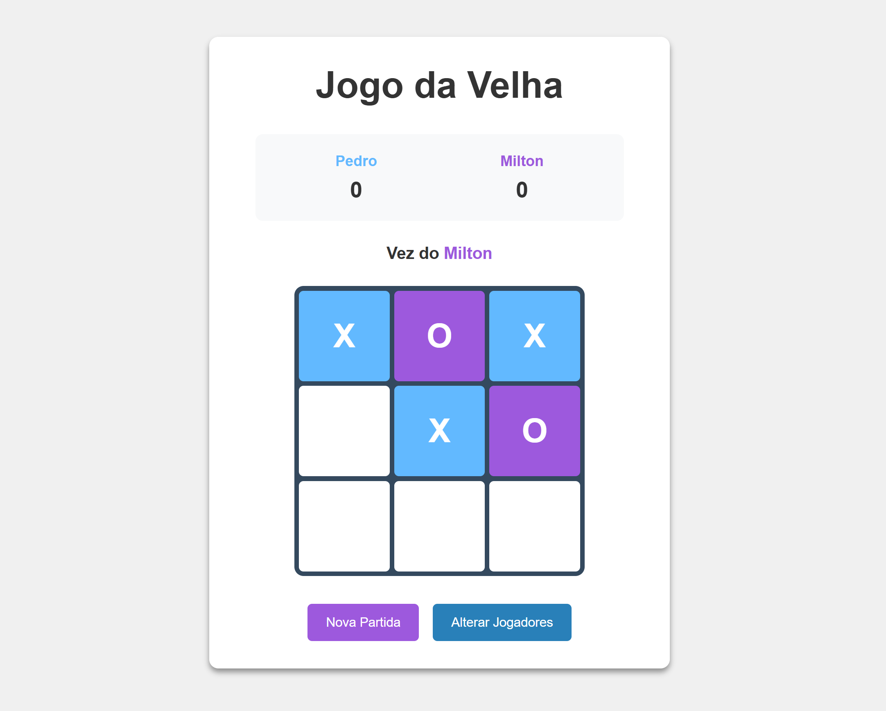
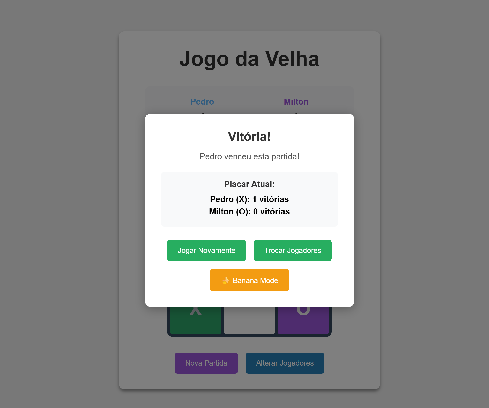
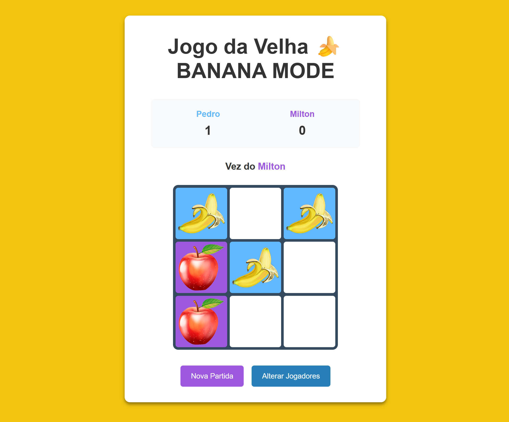

# Tic Tac Banana

Exercício proposto na disciplina de HTML Dinâmico para criação de um Jogo da Velha. Foi desenvolvido com JavaScript, utilização de modal, placar e customização de nomes de jogadores. Além disso, foi introduzido um modo especial de jogo que fica disponível após o término da primeira partida.

## Banana Mode e Aplicação em Sala de Aula

Nesse novo modo de jogo, as letras X e O que inicialmente representam cada um dos jogadores, são substituídas por imagens no formato png. Com isso, a customização do jogo em si fica ainda mais dinâmica e abre num formato de "Easter Egg", já que fica disponível apenas depois do término da primeira rodada.

Nessa versão, X é substituído pela imagem de uma banana (`x.png`) e O é substituído pela imagem de uma maçã (`o.png`). Isso amplia a imersão dos jogadores, especialmente se aplicado a uma faixa etária até dez anos, o que possibilita que "Tic Tac Banana" possa ser utilizado facilmente em aulas de introdução a computação ou introdução a lógica. Pela facilidade da troca das imagens - bastando substituir os arquivos "x.png" e "o.png" para outras imagens com o mesmo nome de arquivo, o jogo pode ser adaptado a quaisquer cenários, inclusive no uso em ensino de idiomas para fixar diferentes conteúdos - novamente dirigido para crianças - ou mesmo como uma variação do "Jogo da Velha".

As imagens são autoajustáveis, limitadas a 90% do grid em que são inseridas, portanto, idealmente, qualquer png com fundo transparente é válido.

## Nomes de Variáveis e Funções

A não ser em casos estritamente obrigatórios devido a linguagem de programação, os nomes de variáveis e funções foram propositalmente modelados em português do Brasil. Essa escolha foi orientada pela possibilidade de uso do jogo em ambientes educacionais de introdução a programação ou lógica, o que facilita o entendimento dos alunos e aumenta a aplicabilidade do código por professores, sem a necessidade de grandes mudanças e ainda mantendo a mesma lógica e orientação que seria utilizada caso a nomenclatura fosse totalmente em inglês.

---

## Guia Rápido do Jogo

Este guia demonstra as principais funcionalidades do Tic Tac Banana.

### 1. Tela Inicial

Tudo começa aqui. Os jogadores podem inserir seus nomes para uma experiência personalizada antes de clicar em "Iniciar Jogo".

### 2. O Jogo Clássico

O tabuleiro principal onde a partida acontece. O placar é atualizado em tempo real e o status sempre informa de quem é a vez de jogar.

### 3. Fim de Partida e o "Easter Egg"

Ao final da primeira partida, o modal de resultado exibe o placar e, como um "Easter Egg", revela o botão para ativar o **🍌 Banana Mode**.

### 4. Banana Mode Ativado!

No Banana Mode, os tradicionais 'X' e 'O' são substituídos por imagens no formato png (inicialmente, uma banana e uma maçã), tornando o jogo mais imersivo e customizável.

